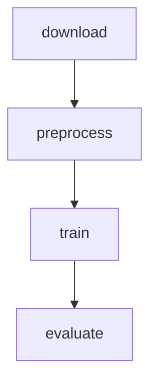
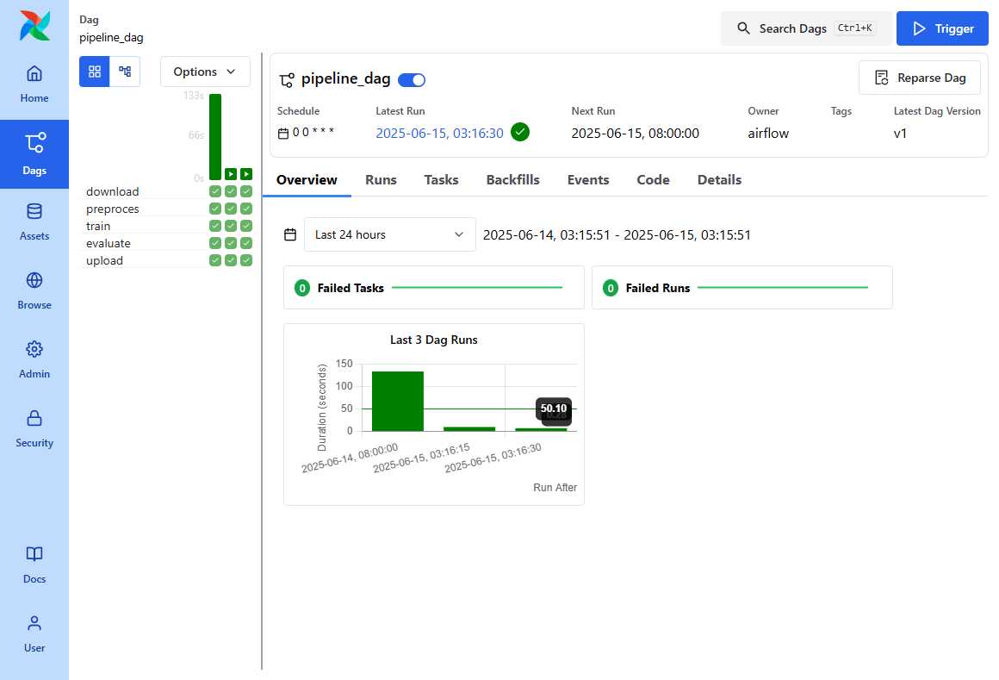

# Инжиниринг данных

## Формулировка ML-задачи

Цель - сделать пайплайн для решения **бинарной задачи классификации**:
определить, является ли опухоль злокачественной или доброкачественной на основе медицинских признаков.
Для решения задачи используется датасет **Breast Cancer Wisconsin Diagnostic**.

## Схема пайплайна


## Этапы ETL-пайплайна (Airflow DAG)

1. __download__:
Скачивание данных по указанной из задания ссылки. Производится несколько попыток запуска чтобы частично избежать возможные ошибки сети.
2. __prepare__:
Обработка и вализация сырых данных. На этом этапе производятся валидация и масштабирование данных для следующего этапа.
3. __train__:
Непосредственно создание и тренировака модели. Валидация на данном этапе НЕ происходит, так как предполагается, что прошлый этап был успешен.
4. __evaluate__:
Вычисление метрик качества модели с использованием модели и данных с прошлых этапов.
5. __upload__:
Загрузка модели и метрик в cloud-хранилище.

Реализация пайплайна производится на основе Apache Airflow.
Запуск каждого последующего этапа зависит от успешного завершения предыдущего.

## Структура проекта
```bash
$ tree
.
├── Makefile
├── README.md
├── dags
│   └── pipeline_dag.py
├── etl
│   ├── config.py
│   ├── download.py
│   ├── evaluate.py
│   ├── preprocess.py
│   ├── train.py
│   └── upload.py
└── user_cfg.sh
```

Опишем файлы:
* `Makefile` - файл, отвечающий за настройку проекта. О его использовании будет написано далее.
* `README.md` - этот файл, документация.
* `dags/pipeline_dag.py` - DAG-файл для Apache AirFlow. Запускает скрипты из папки `etl/`.
* `etl/config.py` - библиотека для других файлов из папки `etl/`. Содержит параметры и общую функцию логирования.
* `etl/download.py` - файл этапа __download__. Осуществляет загрузка датасета с сайта **archive.ics.uci.edu** и его сохранение в формате CSV.
* `etl/evaluate.py` -файл этапа __evaluate__. Осуществляет расчёт метрик качества модели: Accuracy, Precision, Recall, F1-score..
* `etl/preprocess.py` -файл этапа __preprocess__. Осуществляет валидацию данных, стандартизацию признаков с помощью `StandardScaler` и сохранение предобработанных данных.
* `etl/train.py` -файл этапа __train__. Осуществляет обучение модели (`LogisticRegression`) на обучающих данных и её выгрузку в файл.
* `etl/upload.py` -файл этапа __upload__. Отвечает за выгрузку файлов модели и метрика в облако (просто placeholder).
* `user_cfg.sh` - файл настройки Apache AirFlow. Модифицирует файлы `docker-compose.yaml` и `config/airflow.cfg`.

Поток данных между скриптами организован следующим образом:

1. `download.py` сохраняет исходные данные в `data/raw_data.csv`.
2. `preprocess.py` использует этот файл, обрабатывает данные и сохраняет `data/ready_data.csv`.
3. `train.py` загружает `train.csv`, обучает модель и сохраняет её в `results/model.pkl`.
4. `evaluate.py` загружает модель и `data/ready_data.csv`, рассчитывает метрики и сохраняет отчёт в `results/metrics.json`.

Архитектурные решения:

- При ошибке выполнения задачи вызывается функция `notify_failure`, которая потенциально может отправлять сообщение об ошибке в мессенджер;
- Каждый etl-модуль может быть запущен отдельно (например `python3/download.py`), что заметно упрощает отладку и делает логику этапов независимой;
- Все etl-модули написаны с использованием try-exception внутри функции обработки, что даёт возможность обработки некоторых видов исключений (не реализовано)
- Для поиска библиотеки используется `sys.path.append`, так как у нас НЕ используется упаковка библиотеки в python-пакет.
- Проект полностью запускается в docker (проверено на Linux, WSL), что делает деплой простой операцией (+ возможность развёртки в k8s).
- Для деплоя используется Makefile, который производит автоматическое скачивание части файлов и запуск проекта в docker.

## DAG

### Деплой

Зависимости: `docker.io`, `curl`, `bash`, `make`, `sed`.

> ВАЖНО: Проект ТРЕБУЕТ установленного docker.

Деплой происходит через команду `make`. Поддерживаются следующие параметры:

```bash
make # Деплой проекта (требуется docker)
make up # тоже деплой проекта
make down # запуск docker compose down (удаление сервисов, но без удаления данных)
make clean # очистка от данных проекта (вместе с down)
make unpause # Произвести unpause DAG-а
make reload # Перезагрузить доступные DAG-и
make bash # запустить bash внутри runner
make python # запустить python внутри runner
```

### Название DAG

Название DAG: `pipeline_dag`.

Он определён в файле: `dags/pipeline_dag.py`.

### Зависимости между задачами

DAG состоит из пяти последовательных задач, каждая из которых зависит от предыдущей:

1. `download` — загружает исходные данные;
2. `preprocess` — выполняет очистку и масштабирование данных;
3. `train` — обучает модель логистической регрессии;
4. `evaluate` — рассчитывает метрики и сохраняет отчёт;
5. `upload` - загружает метрики и модель в облачное хранилище.

### Запуск DAG вручную

Можно протестировать каждую задачу вручную через команду `airflow tasks test`:

```bash
# Загрузить данные:
airflow tasks test pipeline_dag download
# Запустить preprocessing:
airflow tasks test pipeline_dag preprocess
# Обучение модели:
airflow tasks test pipeline_dag train
# Оценка модели:
airflow tasks test pipeline_dag evaluate
```

## Структура хранения данных

Финальные результаты работы пайплайна сохраняются на локальный диск в папку `./results`.
Промежуточные файлы хранятся в директории `./data`.

Структура папки:
```bash
$ ls results/
metrics.json #метрики качества модели в JSON-формате
model.pkl # модель в формате pickle
```

Пример `metrics.json`:
```json
{
    "accuracy": 0.9736842105263158,
    "precision": 0.9761904761904762,
    "recall": 0.9534883720930233,
    "f1_score": 0.9647058823529412
}
```

## Интеграция с cloud-сервисами

Данный проект использует сайт **archive.ics.uci.edu** для скачивания данных `Breast Cancer Wisconsin Diagnostic`.
Загрузка данных в рамках данного проекта не происходит, поэтому и не испоьзует ключи доступа или переменные окружения.

## Анализ ошибок и устойчивости

Возможные ошибки:
- Загрузка данных (сайт-источник может быть недоступен)
- Валидация данных (данные могут некорректны)
- Сохранение данных на диск (недостаточно места)
- Исключения, вызываемые библиотекой sklearn (обучение модели может уйти в ошибку)

В большинстве случаев происходит неустранимая ошибка, поэтому вызывается соответствующий ошибке `Exception`.
Для попытки устранения ошибки со скачиванием реализованы несколько попыток запуска pipeline.

## Перечень идей/предложений для развития проекта

1. Интеграция со Slack для сообщений об ошибках
2. Обеспечение деплоя проекта к Kubernetes.
3. Добавить поддержку Prometheus для сбора метрик.
4. Сделать загрузку результатов в S3-хранилище.

## Скриншот работающего DAG

